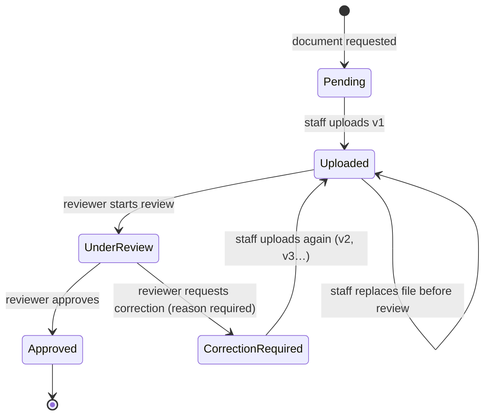
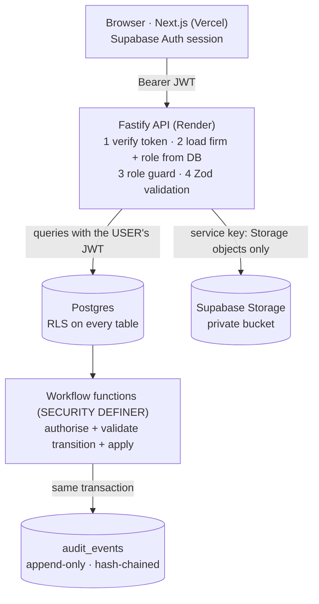
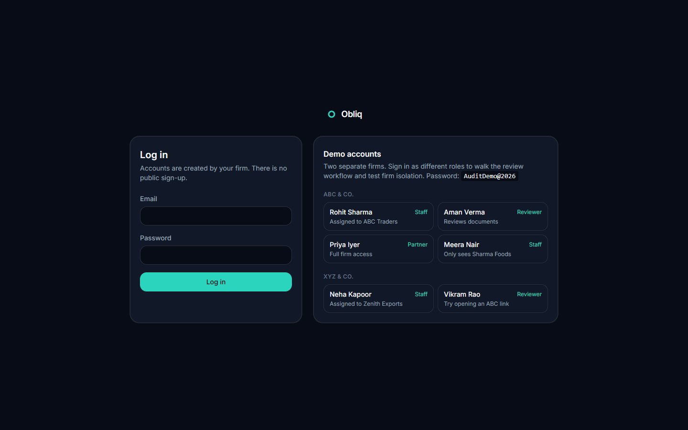
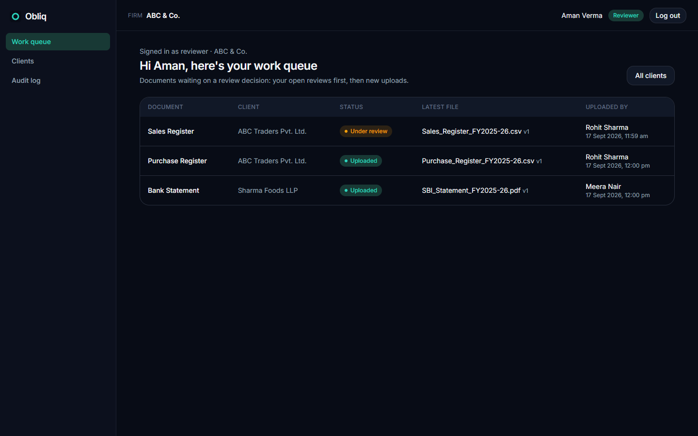
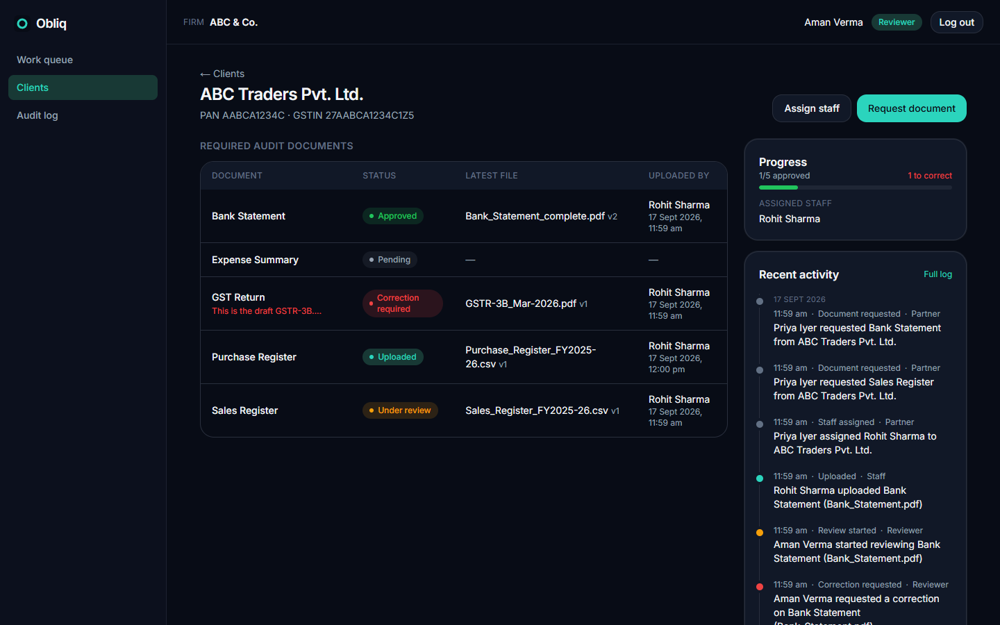
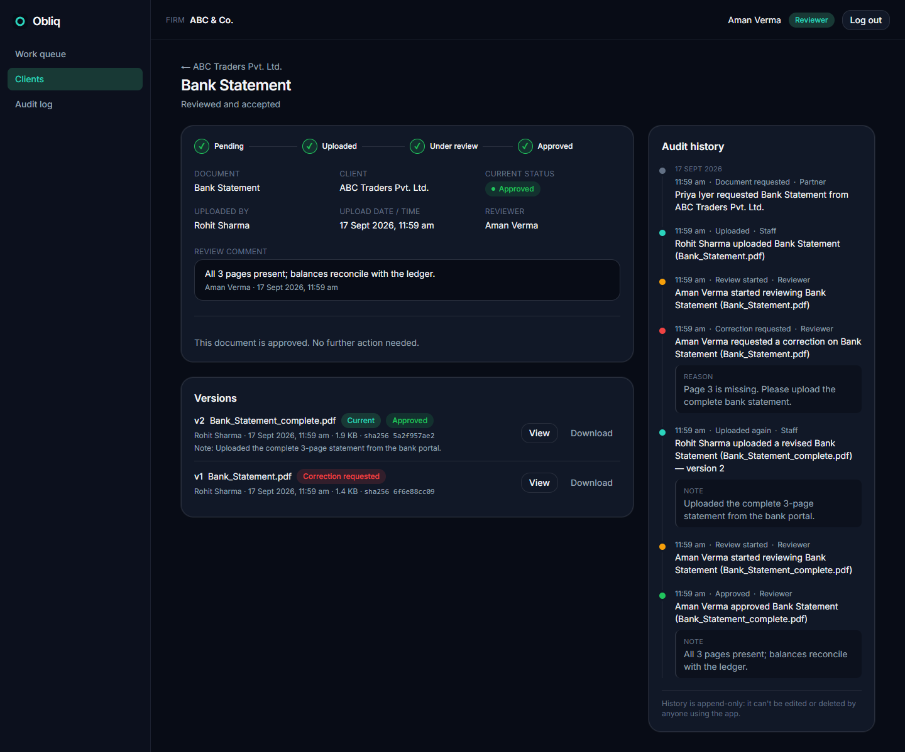
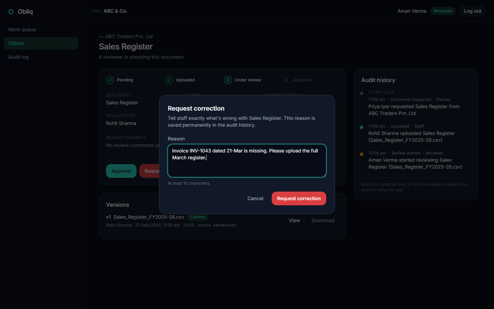
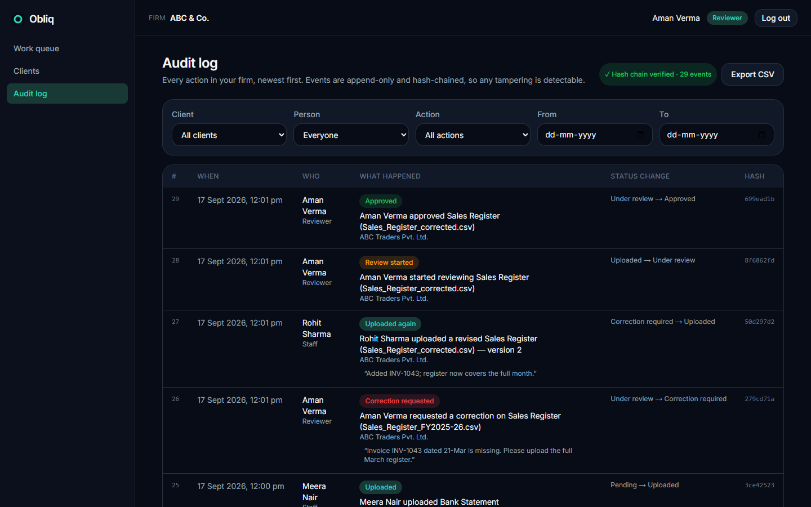
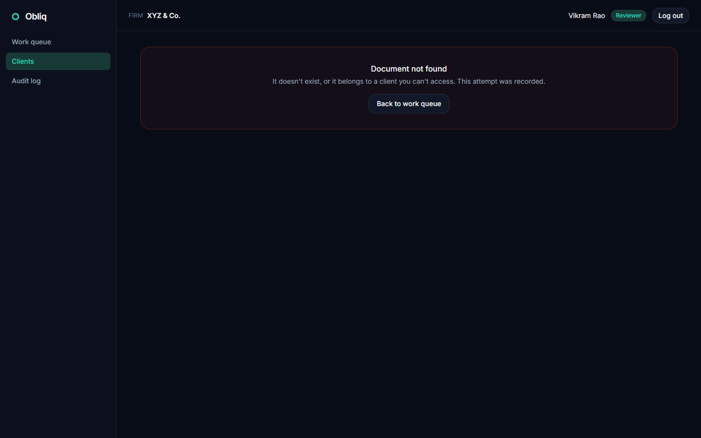

# Obliq — Mini Audit Document Review System

A working prototype for OBLIQ-in's **Audit Workflow Challenge**: a CA firm collects audit documents from a client, reviews them, requests corrections or approves, and keeps a history of every action that nobody can edit.

```
Create/View Client → Add Audit Documents → Upload → Review → Approve or Request Correction → Audit History
```

| | |
|---|---|
| **Live demo** | _Web: add Vercel URL · API: add Render URL (`/docs` for Swagger)_ |
| **Demo accounts** | Buttons on the login page. Password for all: `AuditDemo@2026` |
| **Stack** | Next.js 14 · Fastify · Supabase (Postgres, Auth, Storage) · TypeScript · pnpm + Turborepo |

---

## What it does

### Workflow
1. **Client:** a reviewer or partner creates a client and ticks the documents needed (Bank Statement, Sales Register, Purchase Register, GST Return, Expense Summary, plus any custom ones) and assigns staff.
2. **Documents:** each required document has a status and a version history.
3. **Upload:** assigned staff upload the file (PDF, image, CSV, Excel ≤ 15 MB). Every upload is a new immutable version with a SHA-256 fingerprint.
4. **Review:** a reviewer opens the document page (name, client, uploaded by, upload date/time, status, review comment), starts the review, then **approves** or **requests a correction**, which requires a reason.
5. **Correction loop:** staff see the reason, upload a corrected file, and it goes back to review.
6. **Audit history:** every step is recorded (who, role, what, when, which document and file, from/to status, reason) on the document page and in the firm-wide audit log.

### Status design



I kept the brief's statuses and made two choices:
- "Uploaded Again" is not a separate status; it is the `document.reuploaded` audit event plus a new version number. The document is simply back in *Uploaded*, waiting for review.
- *Under Review* is an explicit step, so the history shows when a reviewer picked the file up, and two reviewers can't decide on the same file at once.

### Roles

| Capability | Staff | Reviewer | Partner (optional) |
|---|:-:|:-:|:-:|
| View clients | assigned only | all in firm | all in firm |
| Upload / respond to correction requests | ✅ | — | ✅ |
| View document status and its history | ✅ | ✅ | ✅ |
| Start review, approve, request correction | — | ✅ | ✅ |
| Create clients, request documents, assign staff | — | ✅ | ✅ |
| Firm-wide audit log, integrity check, CSV export | — | ✅ | ✅ |

**Maker-checker:** whoever uploaded the current version cannot review it, even a partner. The database enforces this.

### Beyond the minimum (all inside the brief's scope)
- **Tamper-evident audit log:** events can't be updated, deleted or truncated by anyone using the app, including the backend's service-role key. Each event is SHA-256 hash-chained to the previous one, and the audit page verifies the chain.
- **Versioned documents:** nothing is overwritten, so the history shows exactly which file was rejected and which was approved.
- **Stale-screen protection:** every review action sends the `row_version` it saw. If someone else changed the document first, the API returns `409` instead of silently overwriting.
- **Blocked access is logged:** opening another firm's document returns `404` and writes an `access.denied` event to the *caller's* firm log, without leaking anything about the other firm.
- **Upload hardening:** extension allow-list, checks that the file's bytes match its extension, sanitised file names, private bucket, 60-second signed URLs.
- **Role-aware work queue:** staff see what to upload or correct; reviewers see what to review.
- **Audit CSV export:** protected against spreadsheet formula injection.

---

## Architecture



**Why this shape:** the brief is about traceability and isolation, so those rules live in the database, the one layer every path goes through. The API adds validation, file handling and clear errors. It is deliberately not the only guard.

**Data model:** `firms` → `firm_memberships (user, role)` → `clients` → `client_assignments` → `documents` → `document_versions` / `review_decisions`, plus `audit_events`. Child tables carry `firm_id` with **composite foreign keys** (`(firm_id, client_id)`), so a row can never reference another firm's parent. SQL lives in [`supabase/migrations`](supabase/migrations).

**Atomic history:** every state change is a Postgres function (`record_document_upload`, `start_review`, `approve_document`, `request_correction`, …). Each one checks the caller, locks the row, validates the transition, updates the document and appends the audit event **in one transaction**, so there can't be a change without its event, or an event without its change.

### How Firm A stays isolated from Firm B

*Authentication ≠ authorization.* Supabase Auth only proves **who** the user is. **What they may see** is decided like this:

1. **The firm comes from the database, never the request.** The API looks up the user's membership (`firm_id`, `role`) using their verified user ID. No body, query parameter or header can choose a firm.
2. **Postgres RLS on every table.** The API queries Supabase *with the user's own JWT*, not an admin key. Policies such as `firm_id = current_firm_id() AND can_access_client(client_id)` mean Firm A's queries cannot return Firm B's rows, even if an API route forgot a filter. Staff are further limited to assigned clients.
3. **Writes only through functions.** Users have no INSERT/UPDATE/DELETE grants. Workflow functions take the actor from `auth.uid()` and re-check firm, role, state and maker-checker, so calling them directly through Supabase's REST API with a stolen UI flow gains nothing.
4. **404, not 403.** Cross-firm IDs look exactly like missing IDs, so they can't be probed, and the attempt is logged as `access.denied`.
5. **Storage:** object paths are `firm/client/document/…`. The database rejects a version whose path isn't inside its own document's folder, and files are served only through short-lived signed URLs after an RLS-checked lookup.

*Frontend hiding a button ≠ security.* The UI hides actions for convenience; [`security.test.ts`](apps/api/src/test/integration/security.test.ts) calls the API **and** Supabase directly as a Firm B user and as staff, and proves each attempt is refused.

---

## Running locally

Prerequisites: Node 22+, pnpm 9, Docker (for the local Supabase stack), [Supabase CLI](https://supabase.com/docs/guides/cli).

```bash
pnpm install
supabase start                 # local Postgres + Auth + Storage; applies supabase/migrations
supabase status                # copy the API URL, anon key and service_role key

cp apps/api/.env.example apps/api/.env              # fill SUPABASE_URL / keys
cp apps/web/.env.local.example apps/web/.env.local  # fill NEXT_PUBLIC_SUPABASE_URL / anon key

pnpm seed                      # two firms, six users, clients and a real review history
pnpm dev                       # web on http://localhost:3000, API on http://localhost:4000 (/docs)
```

To start over: `supabase db reset && pnpm seed`.

**Hosted Supabase instead of Docker:** run the files in `supabase/migrations` in order in the SQL editor, put the project URL and keys in both env files, then `pnpm seed`. To re-seed a hosted project, run `supabase/reset_demo.sql` first.

### Demo accounts (password `AuditDemo@2026`)

| Firm | Name | Role | Try this |
|---|---|---|---|
| ABC & Co. | Rohit Sharma | Staff | Upload the corrected GST Return |
| ABC & Co. | Aman Verma | Reviewer | Review the Sales Register; read the Bank Statement history |
| ABC & Co. | Priya Iyer | Partner | Upload a file, then see maker-checker block your own review |
| ABC & Co. | Meera Nair | Staff | Sees only Sharma Foods, not ABC Traders |
| XYZ & Co. | Neha Kapoor | Staff | Sees only Zenith Exports |
| XYZ & Co. | Vikram Rao | Reviewer | Paste an ABC document URL: 404, and it's logged |

## Testing

```bash
pnpm test               # unit tests: workflow rules, permissions, upload validation, CSV export, UI components
pnpm test:integration   # against the seeded database: isolation, roles, maker-checker, 409s, immutability, hash chain
pnpm lint && pnpm typecheck
```

## Screenshots

| | |
|---|---|
|  |  |
|  |  |
|  |  |
|  | |

## Project layout

```
apps/web          Next.js UI: login, work queue, clients, document review, audit log
apps/api          Fastify API: auth + firm context, clients, documents, queue, audit
packages/shared   Workflow state machine, role matrix, audit wording, shared types
supabase/         Migrations (schema, audit log, workflow functions, RLS, storage) + reset scripts
scripts/          seed-demo.ts, ops/smoke-test.ps1, ops/health-check.py
```

## Deliberately out of scope
Following the brief, there is no WhatsApp integration, OCR, AI, tax logic, notifications, or public sign-up (users are provisioned per firm). The previous GST-compliance prototype in this repository is preserved at git tag `legacy-compliance-v1`.

---

## What would you improve if you had one more week?

**Client-side upload portal with expiring request links.** Today staff still receive files over WhatsApp or email and re-upload them, which is the part of the "scattered" workflow the prototype doesn't remove yet. I'd let a reviewer send a client a single-use, time-limited link scoped to the requested documents. The client uploads directly, and each upload is attributed to the client contact in the same audit trail. This reuses the existing version, review and audit model, removes the manual handoff, and makes the audit trail start at the true source of the evidence.

Alongside it, two smaller, high-value fixes:
- **Reminders and ageing:** a daily job that flags documents stuck in *Pending* or *Correction Required* past an agreed number of days, surfaced in the work queue and by email. Follow-ups are the other big manual cost named in the brief.
- **Hardening what exists:** an audit-log checkpoint (periodically publishing the chain's head hash outside the database, so even a superuser rewrite is detectable), virus scanning on upload, rate limiting, and Playwright end-to-end tests for the full upload → correction → approval flow.

I would not add dashboards or AI yet: the most valuable next step is collecting documents at the source with less chasing.

---

AI Tools Used:
ChatGPT: Not used
Claude: Yes (Claude Code, Anthropic)
Gemini: Not used
Cursor: Not used
GitHub Copilot: Not used

How AI was used:
Claude Code was used as a pair programmer. I read the brief with it and agreed on scope: a focused review workflow, dropping the unrelated GST/AI features from my earlier prototype. It helped design the data model and the database-enforced security (RLS, workflow functions, append-only hash-chained audit log), wrote a first draft of the migrations, API, UI and tests, and ran them locally. I reviewed the decisions, tested the workflow as each role, and can explain every part: tenant isolation, the state machine, maker-checker, and how the audit chain is verified.
